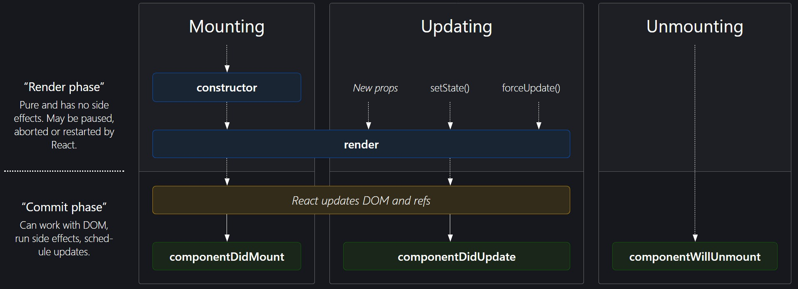

# Component Lifecycle Methods

## 1. The Component Lifecycle
We’ve seen that React components can be highly dynamic. They get created, rendered, added to the DOM, updated, and removed. All of these steps are part of a component’s lifecycle.

The component lifecycle has three high-level parts:

1. Mounting, when the component is being initialized and put into the DOM for the first time
2. Updating, when the component updates as a result of changed state or changed props
3. Unmounting, when the component is being removed from the DOM

Every React component you’ve ever interacted with does the first step at a minimum. If a component never mounted, you’d never see it!

Most interesting components are updated at some point. A purely static component—like, for example, a logo—might not ever update. But if a component’s state changes, it updates. Or if different props are passed to a component, it updates.

Finally, a component is unmounted when it’s removed from the DOM. For example, if you have a button that hides a component, chances are that component will be unmounted. If your app has multiple screens, it’s likely that each screen (and all of its child components) will be unmounted. If a component is “alive” for the entire lifetime of your app (say, a top-level `<App />` component or a persistent navigation bar), it won’t be unmounted. But most components can get unmounted one way or another!

It’s worth noting that each component instance has its own lifecycle. For example, if you have 3 buttons on a page, then there are 3 component instances, each with its own lifecycle. However, once a component instance is unmounted, that’s it—it will never be re-mounted, or updated again, or unmounted.

Take a look at this helpful reference diagram. 

Which methods are called during the mounting phase? What about the update phase?

What causes an update to occur?


<hr>

## 2. Introduction to Lifecycle Methods
React components have several methods, called lifecycle methods, that are called at different parts of a component’s lifecycle. This is how you, the programmer, deal with the lifecycle of a component.

You may not have known it, but you’ve already used two of the most common lifecycle methods: `constructor()` and `render()`! `constructor()` is the first method called during the mounting phase. `render()` is called later during the mounting phase, to render the component for the first time, and during the updating phase, to re-render the component.

Notice that lifecycle methods don’t necessarily correspond one-to-one with part of the lifecycle. `constructor()` only executes during the mounting phase, but `render()` executes during both the mounting and updating phase.
```
import React from 'react';
import ReactDOM from 'react-dom';

class Clock extends React.Component {
  constructor(props) {
    super(props);
    this.state = { date: new Date() };
  }
  
  render() {
    return(
      <div>{this.state.date.toLocaleTimeString()}</div>
    );
  }
}

ReactDOM.render(<Clock />, document.getElementById('app'));
```
Calling `this.state.date.toLocaleTimeString()` will produce a helpful, human-readable representation of the current time.
Notice that this is static—it doesn’t update, even as time goes by.

(Remember: the constructor is the first thing called during mounting. `render()` is called later, to show the component for the first time. If it happened in a different order, `render()` wouldn’t have access to this.state, and it wouldn’t work.)
<hr>

## 3. `componentDidMount`
We’ve made a clock component, but it’s static. Wouldn’t it be nice if it updated?

At a high level, we’d like to update `this.state.date `with a new date once per second.

JavaScript has a helpful function, [`setInterval()`](https://developer.mozilla.org/en-US/docs/Web/API/WindowOrWorkerGlobalScope/setInterval), that will help us do just this. It lets us run a function on a set interval. In our case, we’ll make a function that updates `this.state.date`, and call it every second.

We’ll want to run some code that looks like this:
```
// NOTE: This code doesn't clean itself up properly.
// We'll explore that in the next exercise.
const oneSecond = 1000;
setInterval(() => {
  this.setState({ date: new Date() });
}, oneSecond);
```
We have the code we want to run—that’s great. But where should we put this code? In other words, where in the component’s lifecycle should it go?

Remember, the component lifecycle has three high-level parts:

1. Mounting, when the component is being initialized and put into the DOM for the first time
2. Updating, when the component updates as a result of changed state or changed props
3. Unmounting, when the component is being removed from the DOM

It’s certainly not in the unmounting phase—we don’t want to start our interval when the clock disappears from the screen! It’s also probably not useful during the updating phase—we want the interval to start as soon as the clock appears, and we don’t want to wait for an update. It probably makes sense to stick this code somewhere in the mounting phase.

We’ve seen two functions: the `render()` and the constructor. Can we put this code in either of those places?

- `render()` isn’t a good candidate. For one, it executes during the mounting phase and the updating phase—too often for us. It’s also generally a bad idea to set up any kind of side-effect like this in `render()`, as it can create subtle bugs in the future.
- `constructor()` is also not great. It does only execute during the mounting phase, so that’s good, but you should generally avoid side-effects like this in constructors because it violates something called the Single Responsibility Principle. In short, it’s not a constructor’s responsibility to start side-effects. ([You can read more about the principle on Wikipedia](https://en.wikipedia.org/wiki/Single-responsibility_principle).)

If it’s not `render()` or the constructor, then where? Enter a new lifecycle method, `componentDidMount()`.

`componentDidMount()` is the final method called during the mounting phase. The order is:

1. The constructor
2. render()
3. componentDidMount()

In other words, it’s called after the component is rendered. This is where we’ll want to start our timer.

(Another method, [`getDerivedStateFromProps()`](https://reactjs.org/docs/react-component.html#static-getderivedstatefromprops), is called between the constructor and render(), but it is very rarely used and usually isn’t the best way to achieve your goals. We won’t be talking about it in this lesson.)
```
import React from 'react';
import ReactDOM from 'react-dom';

class Clock extends React.Component {
  constructor(props) {
    super(props);
    this.state = { date: new Date() };
  }
  render() {
    return <div>{this.state.date.toLocaleTimeString()}</div>;
  }
  componentDidMount() {
    const oneSecond = 1000;
    setInterval(() => {
      this.setState({ date: new Date()});
    }, oneSecond);
  }
}

ReactDOM.render(<Clock />, document.getElementById('app'));
```
<hr>

## 4. `componentWillUnmount`
Our clock is working, but it has an important problem. We never told the interval to stop, so it’ll keep running that function forever (or at least, until the user leaves/refreshes the page).

When the component is unmounted (in other words, removed from the page), that timer will keep on ticking, trying to update the state of a component that’s effectively gone. This means your users will have some JavaScript code running unnecessarily, which will hurt the performance of your app.

React will log a warning that looks something like this:
```
Warning: Can't perform a React state update on an unmounted component. This is a no-op, but it indicates a memory leak in your application. To fix, cancel all subscriptions and asynchronous tasks in the componentWillUnmount method.
```
Imagine if the clock gets mounted and unmounted hundreds of times—eventually, this will cause your page to become sluggish because of all of the unnecessary work. You’ll also see warnings in your browser console. Even worse, this can lead to subtle, annoying bugs.

All this bad stuff can happen if we fail to clean up a side-effect of a component. In our case this is a call to `setInterval()`, but components can have lots of other side-effects: loading external data with AJAX, doing manual tweaking of the DOM, setting a global value, and more. We try to limit our side-effects, but it’s difficult to build an interesting app with truly zero side-effects.

In general, when a component produces a side-effect, you should remember to clean it up.

JavaScript gives us the [`clearInterval()`](https://developer.mozilla.org/en-US/docs/Web/API/WindowOrWorkerGlobalScope/clearInterval) function. `setInterval()` can return an ID, which you can then pass into `clearInterval()` to clear it. Here’s the code we’ll want to use:
```
const oneSecond = 1000;
this.intervalID = setInterval(() => {
  this.setState({ date: new Date() });
}, oneSecond);
 
// Some time later...
clearInterval(this.intervalID);
```
At a high level, we want to continue to set up our `setInterval()` in `componentDidMount()`, but then we want to clear that interval when the clock is unmounted.

Let’s introduce a new lifecycle method: `componentWillUnmount()`. `componentWillUnmount()` is called in the unmounting phase, right before the component is completely destroyed. It’s a useful time to clean up any of your component’s mess.

In our case, we’ll use it to clean up the clock’s interval.
```
import React from 'react';

export class Clock extends React.Component {
  constructor(props) {
    super(props);
    this.state = { date: new Date() };
  }
  render() {
    return <div>{this.state.date.toLocaleTimeString()}</div>;
  }
  componentDidMount() {
    const oneSecond = 1000;
    this.intervalID = setInterval(() => {
      this.setState({ date: new Date() });
    }, oneSecond);
  }
  componentWillUnmount() {
    clearInterval(this.intervalID)
  }
}
```

## 5. componentDidUpdate
Remember the three parts of a component’s lifecycle:

1. Mounting, when the component is being initialized and put into the DOM for the first time
2. Updating, when the component updates as a result of changed state or changed props
3. Unmounting, when the component is being removed from the DOM

We’ve looked at mounting (`constructor()`, `render()`, and `componentDidMount()`). We’ve looked at unmounting (`componentWillUnmount()`). Let’s finish by looking at the updating phase.

An update is caused by changes to props or state. You’ve already seen this happen a bunch of times. Every time you’ve called `setState()` with new data, you’ve triggered an update. Every time you change the props passed to a component, you’ve caused it to update.

When a component updates, it calls [several methods](https://reactjs.org/docs/react-component.html#updating), but only two are commonly used.

The first is `render()`, which we’ve seen in every React component. When a component’s props or state changes, `render()` is called.

The second, which we haven’t seen yet, is `componentDidUpdate()`. Just like `componentDidMount()` is a good place for mount-phase setup, `componentDidUpdate()` is a good place for update-phase work.

```
import React from 'react';

export class Clock extends React.Component {
  constructor(props) {
    super(props);
    this.state = { date: new Date() };
  }

  render() {
    return (
      <div>
        {this.props.isPrecise
          ? this.state.date.toISOString()
          : this.state.date.toLocaleTimeString()}
      </div>
    );
  }
  startInterval() {
    let delay;
    delay = this.props.isPrecise ? 100 : 1000;
    this.intervalID = setInterval(() => {
      this.setState({ date: new Date() });
    }, delay);
  }
  componentDidMount() {
    this.startInterval();
  }
  componentDidUpdate(prevProps){
    // Step 1: check mode
    if (this.props.isPrecise === prevProps.isPrecise) {
      return;
    }
    //Step 2: clear existing interval
    clearInterval(this.intervalID);
    // Step 3: start a new interval
    this.startInterval();
  }
  componentWillUnmount() {
    clearInterval(this.intervalID);
  }
}
```

We’ve made a small update to the clock app. Our `<Clock />` component will still render the current time, but it can also be in “precise mode”, where a more standardized, exact version of the time will be shown.

We’d like the clock to update more frequently in precise mode. Instead of updating every second, we’d like it to update 10 times a second (every 100 milliseconds instead of every 1000).

A new method, `componentDidUpdate()` is created. It should take one argument, prevProps, which will be the props this component had the last time it was rendered.

The body of `componentDidUpdate()` has three high-level steps:
1. If `this.props.isPrecise `hasn’t changed, stop now and don’t do the next steps.
2. Clear the existing interval, like we do in `componentWillUnmount()`.
3. Start a new interval. If in “precise” mode, it should run every 100 milliseconds. Otherwise, it should run every 1000 milliseconds as before.

At a high level, a new method called `startInterval()` is created. It’ll be responsible for calculating the interval delay (either 100 or 1000 milliseconds) and calling `setInterval()`. Then we’ll call it from both `componentDidMount()` and `componentDidUpdate()`.

This solves the problem where if the clock is started in “precise” mode, the wrong interval is started and the clock won’t be updated frequently enough and also refactors the code so it's not duplicated.
<hr>

## 6. Review
We’ve come to the end of the lesson. We’ve learned about the three major phases of a component’s lifecycle:

1. Mounting, when the component is being initialized and put into the DOM for the first time. We saw that the `constructor`, `render()`, and `componentDidMount()` are called during this phase.
2. Updating, when the component updates as a result of changed state or changed props. We saw that `render()` and `componentDidUpdate()` are called during this phase.
3. Unmounting, when the component is being removed from the DOM. We saw that `componentWillUnmount()` was called here, which was a good time to clean things up.

We also learned about setting up side-effects and tearing them down. We now know how to make more robust, complex components!

Below is a reference that you can use. It shows the three phases of a component’s lifecycle and which methods are called at each phase. You can also refer to this [interactive diagram](https://projects.wojtekmaj.pl/react-lifecycle-methods-diagram/).

For more, you can read React’s official documentation. See [“State and Lifecycle”](https://reactjs.org/docs/state-and-lifecycle.html) and the [docs for React.Component](https://reactjs.org/docs/react-component.html).

