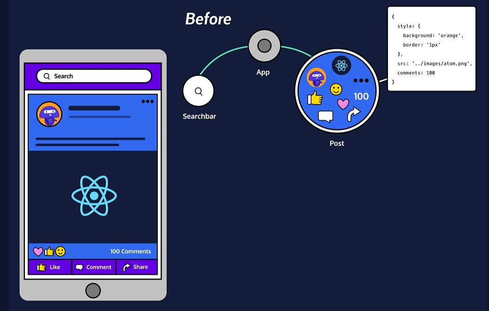
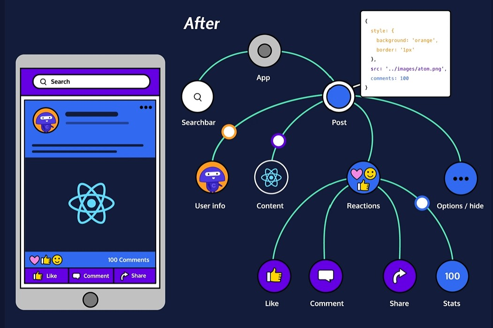

# Stateless components from stateful components

## 1. Stateless Components Inherit From Stateful Components
Our programming pattern uses two React components: a stateful component, and a stateless component. “Stateful” describes any component that has a state property; “stateless” describes any component that does not.

In our pattern, a stateful component passes its state down to a stateless component.




## 2. Build a Stateful Component Class
Let’s make a stateful component pass its state to a stateless component.

To make that happen, you need two component classes: a stateful class, and a stateless class.
```
// Parent.js
import React from 'react';
import ReactDOM from 'react-dom'
import { Child } from './Child'

class Parent extends React.Component {
  constructor(props) {
    super(props);
    this.state = { name: 'Frarthur' };
  }
  render() {
    return <Child name={this.state.name}/>;
  }
}

ReactDOM.render(<Parent/>, document.getElementById('app'))

// Child.js
import React from 'react';

export class Child extends React.Component {
  render() {
    return <h1>Hey, my name is {this.props.name}</h1>;
  }
}
```

A React component should use props to store information that can be changed, but can only be changed by a different component.

A React component should use state to store information that the component itself can change.